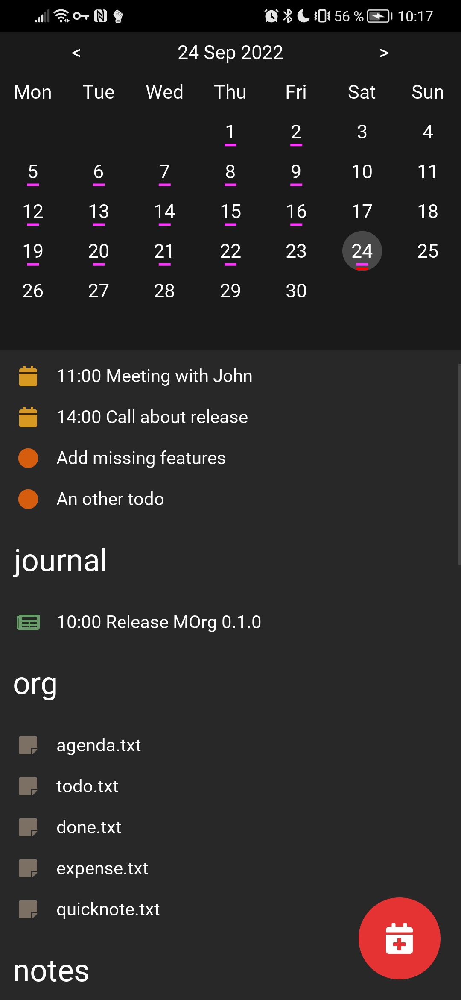
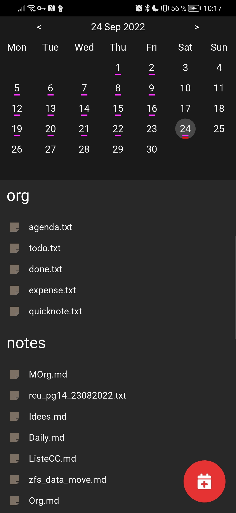
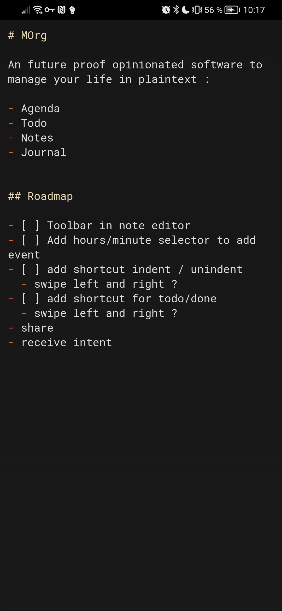
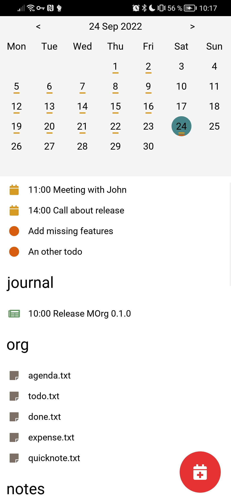
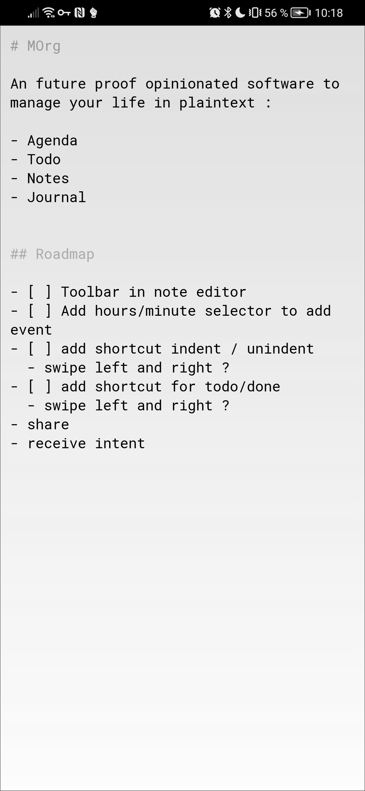

# MOrg

A future proof opinionated software to manage your life in plaintext : todo, agenda, journal and notes.

## Features

- Plain text
- Light/dark mode automtic toggle
- Cross platform

## File structure

- Org
  - agenda.txt
  - done.txt
  - expense.txt
  - quicknote.txt
  - todo.txt
  - archives/
  - attachments/
  - journal/
  - notes/

### Todo.txt and done.txt Format

Use https://github.com/todotxt/todo.txt

Only task with priority (A) or without priority are displayed on main screen.

### Agenda.txt Format

Each line is an event, three format are accepted :
    
YYYY-mm-dd event for all day
YYYY-mm-dd HH:MM event  at hour:minute
YYYY-mm-dd HH:MM HH:MM event with a start and a end

## Roadmap

- [ ] Auto cleaning agenda events
- [ ] Toolbar in note editor
  - [ ] Add hours/minute selector to add event
  - [x] Add shortcut indent / unindent
  - [x] add shortcut for todo/done
- [ ] Share a note
- [ ] Receive android intent

## Sync

Syncing isn t implemented in MOrg, you can use the sync tool you prefers. I personnaly use syncthing.

## Screenshots

### Dark Mode

### Light Mode

